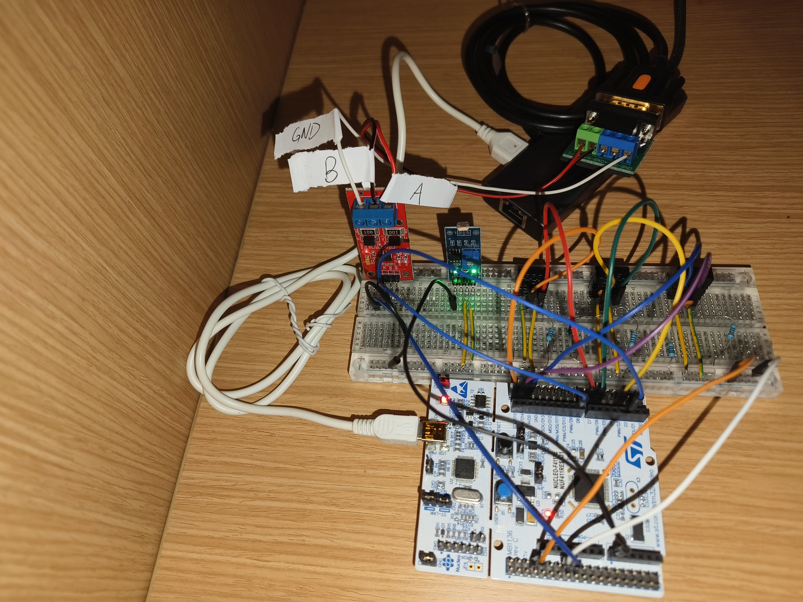
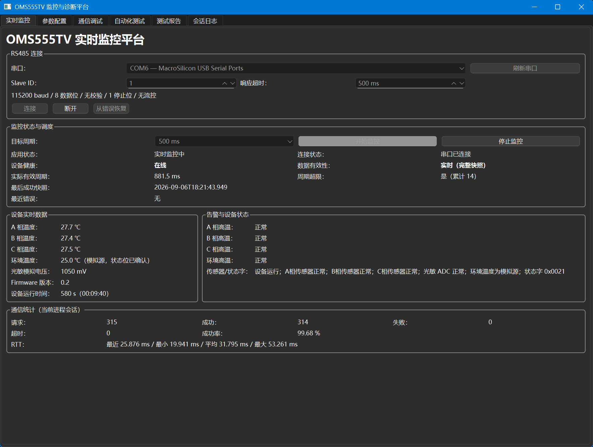
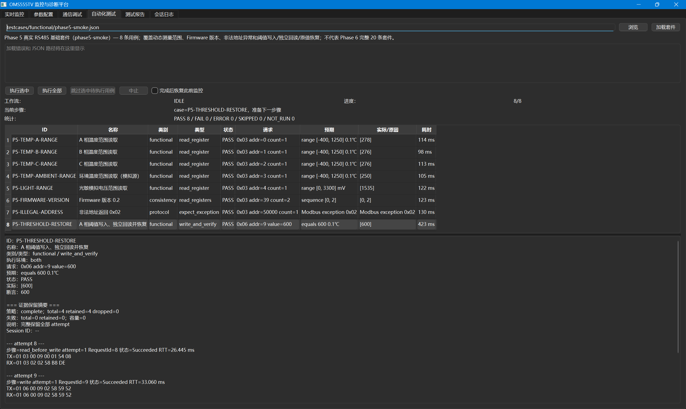
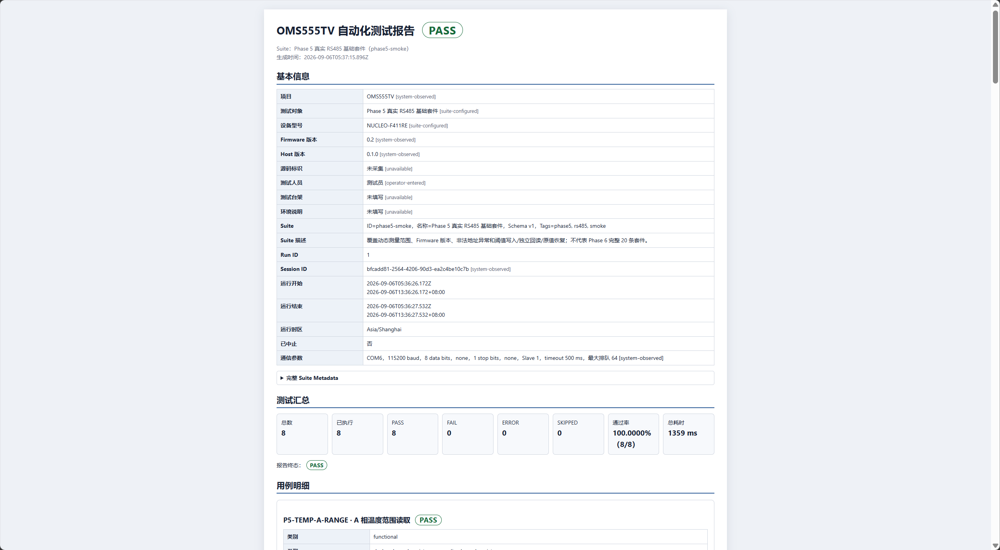
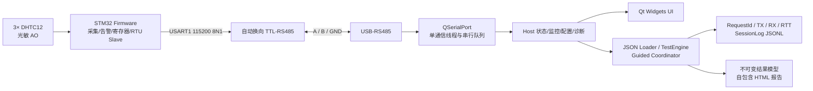

# OMS555TV 电力监测终端自动化测试验证平台

OMS555TV 是一个可复现的嵌入式软硬件测试项目：STM32 采集三路真实温度、一路模拟环境温度和光敏模拟电压，以 Modbus RTU Slave 暴露数据；Windows/Qt Host 通过真实 RS485 完成实时监控、阈值配置、通信诊断、JSON 驱动的自动化/半自动测试和离线 HTML 报告。

当前 MVP 已完成：TASK-029 的最终 README、三个独立目录复现、全量自动化回归和生产 UI 现场彩排均已通过。最终结论与本次量化证据见 [TASK-029 验收记录](docs/test_results/task029_phase9_final_acceptance.md)。

> 安全边界：本项目只用于约 20 cm、安全低压、非隔离的点对点实验台架，不接入市电、高压或实际保护回路。

## 效果展示









参数配置、通信诊断等完整图片及真实性/哈希信息见 [展示素材清单](docs/assets/README.md)。

## 已验证能力

| 能力 | 已验证结果 | 证据 |
|---|---|---|
| STM32 采集与设备模型 | 三路 DHTC12 各 12 个连续有效周期，36 帧双 CRC 全部通过；光敏明暗方向与传感器故障恢复通过 | [硬件基线](docs/hardware_baseline.md) |
| Firmware Modbus RTU Slave | 0x03/0x06、异常响应、坏帧恢复及纯 C 测试通过；RS485 500/500 连续请求成功 | [TASK-009 记录](docs/test_results/task009_firmware_rs485_transport_validation.md) |
| Qt Modbus RTU Master | 生产 QSerialPort 后端经真实 RS485 500/500 请求成功 | [TASK-010 记录](docs/test_results/task010_host_rs485_system_integration.md) |
| 实时监控 | 30 分钟内 17,620/17,620 请求成功，零失败、零超时 | [TASK-012 记录](docs/test_results/task012_monitoring_rs485_30min.md) |
| 完整自动化套件 | 20/20 真实 RS485 主套件 PASS；10 分钟 stability 为 599/599 成功 | [TASK-020 记录](docs/test_results/task020_phase6_rs485_full_validation.md) |
| 半自动故障恢复 | 人工断开/恢复 A/B 后，软件自动观察连续超时与连续合法响应，稳定恢复 716 ms | [TASK-023 记录](docs/test_results/task023_phase7_rs485_guided_recovery.md) |
| 正式报告 | Phase 5 短套件 8/8 PASS，报告保留 11 个 RequestId/TX/RX/RTT 与 SessionLog 摘要 | [TASK-026 记录](docs/test_results/task026_phase8_report_export.md) · [示例 HTML](docs/examples/task026-phase5-rs485-report.html) |

上述结果分别来自实机、Fake 或虚拟时间的边界均在对应记录中说明；不能相互替代或外推。

## 系统架构



Host 中 `IModbusClient` 是唯一通信边界。监控、配置、自动化和半自动测试通过集中状态机互斥取得通信所有权；QWidget 不直接访问串口、构造 RTU 或解释 CRC。详细模块、状态机、数据流和报告链路见 [架构设计](docs/architecture.md)。

## 硬件列表与接线

| 硬件 | 当前基线 |
|---|---|
| 开发板 | NUCLEO-F411RE / STM32F411RET6，板载 ST-LINK/V2-1 |
| 温度 | DHTC12 ×3，分别使用 I2C1/2/3，3.3 V、4.7 kΩ 上拉 |
| 光敏 | 4 线制光敏模块，AO→PA0/ADC1_IN0，3.3 V |
| TTL-RS485 | MAX13487EESA 系列自动换向模块，5 V；PA9→RXD、PA10←TXD |
| USB-RS485 | DTECH 两线转换器；端口在运行时枚举 |

总线侧只连接 `A↔T/R+`、`B↔T/R-`、`GND↔GND`。A/B 不得带电短接或反接试错，所有模块必须共地。完整引脚、电气约束、供电和实测边界见 [硬件与通信基线](docs/hardware_baseline.md) 与 [RS485 接口规范](specs/rs485_hardware_interface.md)。

## 软件环境

MVP 已验证平台为 Windows x64；Linux 尚未完成构建或串口实机验证。

| 工具 | 已验证版本/配置 |
|---|---|
| Host | C++17、Qt 6.8.3 `msvc2022_64`、MSVC 19.51、CMake、Ninja |
| Firmware | STM32CubeMX 6.18.1-RC2、STM32CubeF4 v1.28.3、HAL |
| ARM 工具链 | GNU Tools for STM32 14.3.1；STM32Cube bundle CMake 4.3.1、Ninja 1.13.2 |
| 烧录 | STM32CubeProgrammer 2.23.0，经板载 ST-LINK/SWD |
| 通信 | Modbus RTU，Slave ID 1，115200 baud，8N1，无流控，初始超时 500 ms |

## 构建 Host

以下命令在仓库根目录的 PowerShell 7 中执行。`$hostBuild` 应指向一个尚不存在的项目专属目录；Qt 安装路径不同时需调整 `$qtRoot`。

```powershell
$projectRoot = (git rev-parse --show-toplevel).Trim()
$hostBuild = Join-Path $projectRoot 'build-local-host'
$qtRoot = 'D:\Dev\Qt\6.8.3\msvc2022_64'
$vsDevShell = 'C:\Program Files\Microsoft Visual Studio\18\Community\Common7\Tools\Launch-VsDevShell.ps1'

& $vsDevShell -Arch amd64 -HostArch amd64 -NoLogo
cmake -S (Join-Path $projectRoot 'host\qt') -B $hostBuild -G Ninja "-DCMAKE_PREFIX_PATH=$qtRoot" -DCMAKE_BUILD_TYPE=Debug
cmake --build $hostBuild --parallel
ctest --test-dir $hostBuild --output-on-failure
```

应用产物为 `$hostBuild\src\oms555tv_host.exe`。`host.application.smoke` 使用 Qt offscreen 平台，不访问串口或硬件。

## 构建与测试 Firmware

STM32Cube 工具来自 `%LOCALAPPDATA%\stm32cube\bundles`，只修改当前 PowerShell 进程的 `PATH`。真实 RS485 镜像必须显式选择 `USART1_RS485`，并确认配置输出包含 `Modbus transport: USART1_RS485`。

```powershell
$projectRoot = (git rev-parse --show-toplevel).Trim()
$bundleRoot = Join-Path $env:LOCALAPPDATA 'stm32cube\bundles'
$firmwareBuild = Join-Path $projectRoot 'build-local-firmware-rs485'
$env:Path = "$(Join-Path $bundleRoot 'gnu-tools-for-stm32\14.3.1+st.2\bin');$(Join-Path $bundleRoot 'ninja\1.13.2+st.1\bin');$env:Path"
$bundleCmake = Join-Path $bundleRoot 'cmake\4.3.1+st.1\bin\cmake.exe'

& $bundleCmake -S (Join-Path $projectRoot 'firmware\stm32') -B $firmwareBuild -G Ninja "-DCMAKE_TOOLCHAIN_FILE=$(Join-Path $projectRoot 'firmware\stm32\cmake\gcc-arm-none-eabi.cmake')" -DCMAKE_BUILD_TYPE=Debug -DOMS555TV_MODBUS_TRANSPORT=USART1_RS485
& $bundleCmake --build $firmwareBuild --parallel
```

固件产物为 `$firmwareBuild\oms555tv_firmware.elf`。纯 C 业务/协议测试使用当前 MSVC 开发环境，在另一个目录执行：

```powershell
$firmwareTests = Join-Path $projectRoot 'build-local-firmware-tests'
cmake -S (Join-Path $projectRoot 'firmware\stm32\tests') -B $firmwareTests -G Ninja -DCMAKE_BUILD_TYPE=Debug
cmake --build $firmwareTests --parallel
ctest --test-dir $firmwareTests --output-on-failure
& (Join-Path $firmwareTests 'phase1_unit_tests.exe')
```

## 固件烧录与设备连接

若开发板已经运行已验证的 USART1/RS485 Firmware，无需为普通演示重复烧录。需要更新时：

1. 保持 RS485 台架为安全低压状态，用 USB 连接 NUCLEO 的 ST-LINK 口。
2. 打开 STM32CubeProgrammer 2.23.0，选择 ST-LINK/SWD 并连接目标板。
3. 选择刚构建的 `oms555tv_firmware.elf`，执行下载、校验和软件复位。
4. 断开 Programmer 对目标的占用，确认板卡运行；不要误烧录默认 `USART2_VCP` 构建。
5. 接通 USB-RS485，重新枚举端口；端口号可能变化，不得写死 COM6。

烧录会改变设备当前 Firmware，执行前应核对产物目录、`USART1_RS485` 配置输出和 ELF 时间戳。

## 启动和使用 Host

```powershell
$projectRoot = (git rev-parse --show-toplevel).Trim()
$qtRoot = 'D:\Dev\Qt\6.8.3\msvc2022_64'
$env:Path = "$(Join-Path $qtRoot 'bin');$env:Path"
Push-Location $projectRoot
& '.\build-local-host\src\oms555tv_host.exe'
Pop-Location
```

1. 在“实时监控”页刷新串口，根据 USB-RS485 设备的运行时枚举结果选择端口，设置 Slave ID 1、500 ms，再连接。
2. 启动监控后确认应用为“实时监控中”、设备 Online、数据持续更新；失败批次不会覆盖最近成功快照。
3. 修改阈值前先停止监控，在“参数配置”页读取并保存四路原值；写入后必须独立回读，演示结束后恢复原值并整块复核。
4. “通信调试”页可按级别、结果或 RequestId 查看功能码、TX/RX、CRC、RTT 和结构化错误。
5. “会话日志”页在测试前开始会话，在测试完成后结束会话；原始 JSONL 位于忽略目录 `output/logs/`。

推荐的 5～10 分钟流程、预期画面和异常退出步骤见 [现场演示手册](docs/demo_runbook.md)。

## Modbus RTU 简介

当前生产链路由 Host Master 发起请求，STM32 Slave ID 1 响应。MVP 支持 0x03（读保持寄存器）和 0x06（写单寄存器），并返回标准 0x01/0x02/0x03 异常。温度以有符号 `int16`、0.1 ℃表示；光敏值为 `uint16` mV；32 位运行时间采用低字在低地址、高字在高地址。完整地址、访问权限、缩放、状态位和异常语义见 [Modbus 寄存器表](docs/modbus_register_map.md)。

## 自动化、半自动测试与报告

- `testcases/functional/phase5-smoke.json`：8 条、约 1 秒的现场短套件，覆盖动态值、Firmware 版本、非法地址和阈值写入/回读/恢复。
- `testcases/phase6/phase6-rs485-full.json`：20 条正式实机主套件，含 10 分钟稳定性；不用于普通短演示。
- `testcases/phase6/phase6-fake-boundaries.json`：4 条只能由 Fake 确定性验证的边界用例。
- `testcases/phase7/phase7-rs485-disconnect-recovery.json`：引导式物理断线—恢复，可作为高级演示段；必须按安全提示操作 A/B。

在“自动化测试”页加载套件后，Host 通过状态机停止监控、取得 Testing owner、串行执行并可按用户选择恢复监控。结果明确区分 PASS/FAIL/ERROR/SKIPPED，并保留 RequestId、TX/RX、RTT、实际值、错误与清理结果。

运行结束且 SessionLog 已结束后，在“测试报告”页填写测试人员并生成 HTML。报告是 UTF-8、自包含、无脚本文件，不覆盖同名文件；原生 PDF 未实现，可用浏览器打印。可直接查看 [真实脱敏示例报告](docs/examples/task026-phase5-rs485-report.html)。

## 项目亮点

- Firmware 采集、协议、Host UI 和测试报告形成真实 RS485 软硬件闭环。
- 单通信线程、串行请求队列和集中 owner 状态机避免监控/配置/测试争抢串口。
- Schema v1/v2/v3 JSON 将基础、复合、稳定性和人工引导测试数据化，同时保持严格版本边界。
- 每次请求贯穿 RequestId、TX/RX、CRC、RTT、诊断、JSONL、不可变结果与 HTML 报告，便于追溯。
- 参数写入采用写前保存、独立回读、失败清理和最终恢复；半自动恢复的 PASS 由软件观察决定，而不是人工主观确认。
- 单元、Fake、虚拟时间和真实硬件证据分层保存，量化结论都可回到验证记录。

## 文档与追溯

- [项目需求基线](PROJECT_SPEC.md) · [PRD](docs/prd.md) · [架构设计](docs/architecture.md)
- [硬件基线](docs/hardware_baseline.md) · [寄存器表](docs/modbus_register_map.md)
- [测试计划](docs/test_plan.md) · [测试用例目录](docs/test_cases.md) · [缺陷记录](docs/bug_records.md)
- [MVP 最低验收矩阵](docs/mvp_acceptance_matrix.md) · [现场演示手册](docs/demo_runbook.md)
- [完整任务历史](docs/task_index.md) · [Phase 9 文档审计](docs/test_results/task027_phase9_documentation_audit.md)

仓库结构：

```text
firmware/stm32/   STM32 Firmware 与纯 C 测试
host/qt/          C++/Qt Host、工具与 CTest
testcases/        Schema v1/v2/v3 JSON 测试资产
docs/             需求、架构、硬件、协议、测试与展示材料
research/         调研记录
specs/            技术规范
tasks/            可独立验收的任务
output/           本地日志与报告（只保留 .gitkeep）
```

## 已知限制与后续规划

- Windows x64 是唯一已验证 Host 平台；Linux 仅保留源码可移植边界。
- 当前证据来自单台设备、约 20 cm、非隔离点对点 RS485，不代表工业长线、多设备、终端/偏置、隔离或 EMC 结果。
- 环境温度为明确标记的软件模拟源；光敏值是未校准 ADC 毫伏值，不是照度。
- USB 自动重连、Raw Frame、CRC 错误注入、原生 PDF、安装包和 CI/CD 不属于当前 MVP。
- 8/24 小时真实稳定性、Linux 构建/串口实测、工业长线/隔离/EMC 和更多故障注入应分别立项验证，不能由既有短台架结果推定。

Phase 9 与当前 MVP 已关闭；最终复现和现场彩排证据见 [TASK-029 验收记录](docs/test_results/task029_phase9_final_acceptance.md)。
