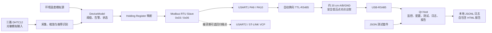
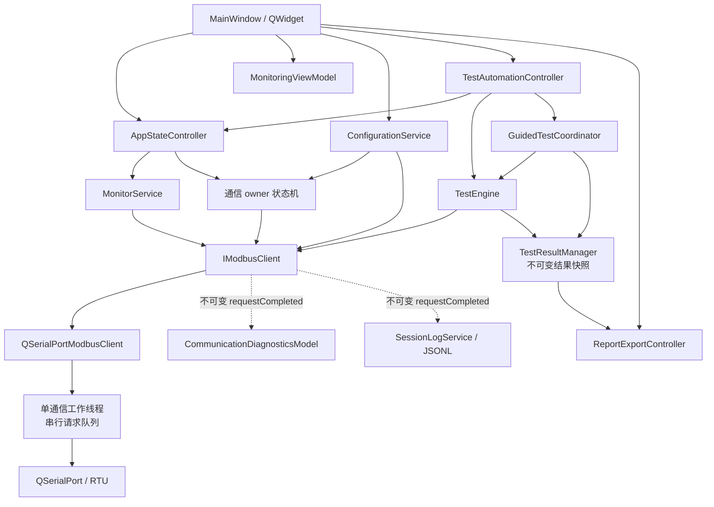
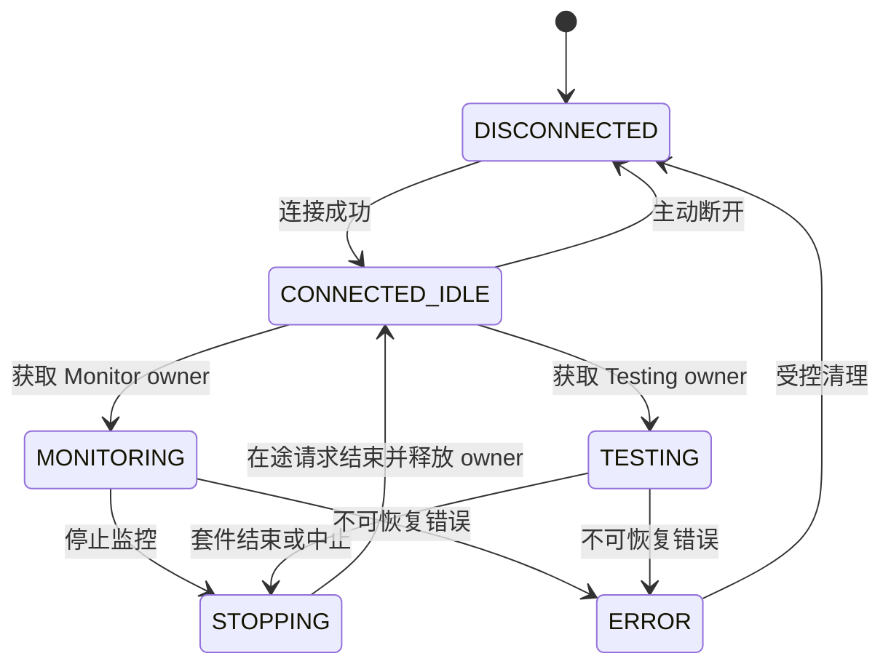
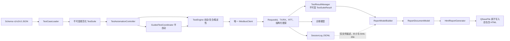

# 系统架构设计

> 状态：MVP 实现基线 2.0，Phase 0～8 已完成，TASK-027 已完成一致性审计
>
> 日期：2026-09-06

## 1. 架构目标

系统需要把 DUT 数据采集、Modbus RTU、上位机监控和自动化测试组合为可验证闭环。核心约束是通信通道单一所有权、UI 非阻塞、协议逻辑与界面分离，以及测试证据可追溯。

## 2. 系统边界

生产镜像只启用 USART1/RS485 端点；USART2/VCP 仅为编译期互斥的历史回归端点。数据库、Web 后台、云服务、IEC 61850 和真实高压系统不在 MVP 边界内。

## 3. 固件模块

| 模块 | 职责 |
|---|---|
| `platform` | HAL 适配、时钟、GPIO、UART、ADC |
| `acquisition` | 原始值采集、缩放、范围约束和异常识别 |
| `device_model` | 温度、阈值、告警、状态、统计和版本信息 |
| `alarm` | 阈值与迟滞状态转换 |
| `register_map` | 业务模型与 0-based Modbus 地址映射 |
| `modbus_slave` | RTU 帧解析、CRC、0x03/0x06 和异常响应 |

硬件相关代码与可纯 C 测试的协议/业务逻辑应分离。

### 3.1 硬件实例

- 目标板为 NUCLEO-F411RE / STM32F411RET6，使用 HSI/PLL 100 MHz 和 HAL 裸机事件循环。
- A/B/C 相 DHTC12 分别使用 I2C1（PB8/PB9）、I2C2（PB10/PB3）和 I2C3（PA8/PC9）。
- 光敏模块 AO 使用 PA0/ADC1_IN0，3.3 V 供电；数据表示为毫伏，不表示校准照度。
- 环境温度当前为带状态位的软件模拟源，不能与真实传感器值混淆。
- 生产实测链路使用 USART1 PA9/PA10 和 MAX13487EESA 系列自动换向 TTL-RS485 模块，不使用 DE/RE GPIO；USART2/ST-LINK VCP 保留为编译期可选回归通道。单个 Firmware 镜像只启用一个 Modbus 端点。TASK-002/009/010 的真实 RS485 闭环与恢复验收已通过。

详细接线、电气约束与待验证项以 `docs/hardware_baseline.md` 为准。

## 4. 上位机模块

| 模块 | 职责 |
|---|---|
| `app` | 生命周期、依赖组装和全局状态机 |
| `communication` | 串口配置、请求队列、Modbus 后端、错误和原始帧 |
| `device` | 寄存器到领域数据的解析、缩放和写入校验 |
| `monitor` | 周期轮询、在线状态和通信统计 |
| `configuration` | 阈值读取、写入、独立回读、部分失败和 owner 生命周期 |
| `diagnostics` | 消费不可变请求结果，提供有界记录、筛选和完整事务详情 |
| `testing` | 用例加载、执行、断言、重试、中止和结果模型 |
| `logging` | 结构化日志、会话归档和 UI 日志模型 |
| `report` | HTML 报告模型与渲染 |
| `ui` | 展示和用户输入，不实现协议业务 |

`IModbusClient` 是监控与测试共同依赖的边界；Fake 实现用于无硬件单元测试。

图中的 `Monitor`、`Testing` 和 `ManualDebug` owner 在同一时刻最多存在一个；UI 只能发出意图和呈现结果，不能直接访问串口、构造 RTU 或解释 CRC。

## 5. 通信并发模型

已确认采用“QSerialPort 受控 RTU 后端 + 单通信工作线程 + 串行请求队列”：

1. 串口及通信状态机只在通信线程访问。
2. 应用状态机决定 `MONITORING` 或 `TESTING` 的请求来源。
3. 模式切换先停止新请求，再等待在途请求结束或受控取消。
4. 结果通过 queued signal 返回，不从工作线程操作 QWidget。
5. 每个请求分配 ID，并携带时间戳、超时、TX/RX、RTT 和结构化错误。

QSerialPort 后端负责完整 RTU ADU、CRC、分帧、超时和证据；`device` 模块继续负责寄存器领域解释。Qt SerialBus 仅保留技术探针，不作为生产后端，因为公开 API 不能提供包含 Slave 地址和 CRC 的完整 RTU TX/RX 证据。

备选的 Qt SerialBus 主后端和 UI 线程纯事件驱动方案均不采用。完整决策、风险与回退条件见 `docs/decisions/2026-09-03-Host-Modbus后端.md`。

## 6. 应用状态机

状态迁移必须集中管理；未连接禁止监控和测试，测试与监控互斥。

TASK-011 已实现 `AppStateController` 与 `MonitorService`：控制命令采用同步接受/拒绝和异步终态通知；Monitor owner 获取成功后，按 `deviceSnapshotReadBlocks` 严格串行读取五块，只有整批成功并经 `RegisterCodec` 解码后才发布快照。连续三批失败判定 Offline，停止时受控取消唯一请求并在释放 owner 后返回 `CONNECTED_IDLE`。周期、错误、统计和恢复细节以 `specs/host_phase4_monitoring_core.md` 为准。

TASK-012 已实现 `MonitoringViewModel`、`QtSerialPortCatalog` 和 Qt Widgets `MainWindow`。窗口只绑定展示模型；串口打开、所有权、轮询和领域解码仍由既有层负责。展示模型统一派生按钮门禁、字段单位、模拟源、最后成功时间和陈旧状态，失败批次不覆盖成功快照。生产组装、offscreen UI 测试、30 分钟真实 RS485 和设备复位显式恢复均已通过，细节以 `specs/host_phase4_monitoring_ui.md` 和对应测试记录为准。

TASK-013 已实现 `ConfigurationService`、`CommunicationDiagnosticsModel` 与 `SessionLogService`。配置仅在 `CONNECTED_IDLE` 获取 `ManualDebug` owner，写前保存当前值，每路 0x06 后执行独立 0x03 回读，部分失败继续但不发布未验证值，完成/失败/取消均走 owner 清理。诊断与 JSONL 日志共同消费不可变 `requestCompleted` 结果；生产内存分别保留最近 1000/2000 条，单日志文件 10 MiB、单会话最多 100 个分片。MainWindow 只绑定服务和模型，不包含 QSerialPort、RTU/CRC 或硬编码寄存器地址。完整行为见 `specs/host_phase4_configuration_and_diagnostics.md`。

## 7. 数据与错误模型

- 传输数据以 `quint16` 寄存器为边界，温度使用有符号定点数 ×0.1℃。
- 32 位数据采用低字在低地址、高字在高地址；单寄存器仍按 Modbus 规范高字节先传输。
- 光敏模拟电压使用 `uint16` 毫伏值，范围 0～3300。
- 错误分类至少包括串口、超时、CRC、协议异常、参数、断言、配置和报告错误。
- 底层返回错误代码、上下文和原始证据；UI 决定展示方式。

## 8. 测试架构

`TestCaseLoader` 负责 JSON 模式校验，`TestEngine` 只执行规范化用例，处理器按测试类型扩展。`TestResultManager` 保存不可变执行结果，`ReportGenerator` 只消费结果模型，不重新解释通信数据。

TASK-014 已实现上述输入边界：`test-suite-v1.schema.json` 与 C++ Loader 共同拒绝未知版本/字段和非法跨字段组合，配置错误携带稳定错误码、JSON 路径与套件/用例上下文。`read_register` 显式规范化为 `count=1` 的 `ReadRegisters`，模型分别保存单请求/用例总 timeout 和显式 retry；`TestAssertions` 只消费寄存器值或 Modbus 异常，不依赖 `IModbusClient`。测试用例配置与执行状态模型保持分离，详细契约见 `specs/host_phase5_testcase_schema.md`。

TASK-015 已实现无 QWidget 的 `TestEngine`、处理器注册边界和 `TestResultManager`。TASK-016/UI 先通过应用状态机取得 Testing owner，引擎只在 `TESTING` 状态执行，并在终态调用 `stopTesting()` 等待 owner 释放。四类基础处理器分别管理读取、写入、期望异常和写入/独立回读/恢复步骤；中心调度统一负责用例预算、显式 retry、中止、RequestId/完整事务证据与 TEST 日志。结果管理器以复制替换方式发布不可变快照，报告层无需重新解释通信结果。完整状态、错误优先级与清理规则见 `specs/host_phase5_test_engine.md`。

TASK-016 已实现 `TestAutomationController` 和 Qt 自动化测试页面。控制器在线程池读取并加载 JSON，在应用线程编排 `MONITORING -> STOPPING -> CONNECTED_IDLE -> TESTING -> CONNECTED_IDLE`，仅在用户显式选择且运行前确实处于监控时恢复监控；MainWindow 只渲染 Loader、ResultManager 和步骤通知，不访问串口或解释 RTU。Phase 5 基础套件使用 8 条安全用例覆盖动态测量范围、版本、非法地址和阈值恢复，真实 RS485 已验证。完整 UI 和交接契约见 `specs/host_phase5_automation_ui.md`。

TASK-017 已在保持 v1 严格兼容的前提下新增独立 Schema v2、Loader 和不可变规范化模型。v2 固化逐元素断言、受限 sequence、仅限 Fake 确定性故障注入的预期超时、低字在低地址的 uint32 一致性，以及 10 分钟至 24 小时稳定性配置和整数 ppm 汇总边界；覆盖矩阵明确 Fake、真实 RS485 与 Phase 7 人工恢复的责任边界。TASK-018～TASK-020 已继续完成运行状态机、20+ 正式套件和实机验收。详细契约见 `specs/host_phase6_testcase_schema.md`。

TASK-018 已扩展统一处理器决策边界，使处理器可在“下一请求、单次有界延迟、唯一终态”之间推进。sequence 按 repetition/step 顺序保存不可变逻辑步骤和 attempt 关联；expect_timeout 仅识别结构化 `ResponseTimeout`；consistency 聚合 uint32 样本；stability 按实际请求开始间隔串行运行且不追赶积压。Engine 使用注入调度器的单调时间判断 duration、interval 和 case budget，UTC 仅作审计；稳定性结果固定保留首条、均匀样本、失败窗口和末条，完整事务继续写入滚动 JSONL。中止会取消等待或普通在途请求并沿既有状态机释放 Testing owner。详细契约见 `specs/host_phase6_execution_engine.md`。

TASK-019 已将上述能力落成 20 条真实 RS485 主套件和 4 条独立 Fake 边界用例。控制器把 Engine 的逻辑步骤索引、step ID 和 repetition 透传到 UI；MainWindow 只从控制器与 `TestResultManager` 显示 sequence 明细、稳定性迭代/聚合统计、证据保留策略和 Session ID，不重新解释断言。正式 10 分钟配置保持不变，CTest 使用共享虚拟单调时钟完成全套验证；TASK-020 已补充真实 DUT 与长时 RS485 证据。详细契约见 `specs/host_phase6_complete_suite_ui.md`。

TASK-020 已在当前约 20 cm 安全低压点对点台架上关闭 Phase 6。专用验收工具复用生产 MainWindow、唯一 QSerialPort 后端、集中状态机、配置服务、诊断/会话日志和自动化执行链；短时预检、独立中止与正式完整会话彼此隔离。真实等待使用 `Qt::PreciseTimer`，仍按实际请求开始时刻串行调度且不追赶积压。最终 20 条主套件全部 PASS，10 分钟稳定性 599/599 成功，结果/诊断/通信日志/TEST 日志的 647 个 RequestId 一致，阈值恢复和 UI 心跳通过。详细门禁与证据见 `specs/host_phase6_rs485_full_validation.md` 和对应验证记录；该结论不包含 Phase 7 人工物理恢复或 Phase 8 正式报告。

TASK-021 已新增独立 Schema v3 与纯数据引导模型，同时保持 v1/v2 自动套件语义不变。`guided_recovery` 固定为断线提示、中断观察、重连提示、恢复观察四步；人工动作必须匹配 run/case/step/一次性 token，确认只推进流程，连续结构化 `ResponseTimeout` 和连续合法 0x03 响应才构成自动证据。人工等待、观察 deadline 与总预算均有界，恢复结果同时保留首个成功和稳定恢复耗时，并把人工动作、观察探测、RequestId/TX/RX/RTT、终态原因和未恢复接线指引纳入不可变快照。TASK-022/023 已继续完成协调器、UI 和真实断线恢复验收，详细契约见 `specs/host_phase7_guided_test_schema.md`。

TASK-022 已实现无 QWidget 依赖的 `GuidedTestCoordinator`。v3 路径由 `TestAutomationController` 取得 Testing owner 后交给协调器，协调器在整个人工等待与观察期间持续持有 owner，并在终态受控释放；v1/v2 仍由既有 TestEngine 套件路径执行。TestEngine 仅新增与普通运行互斥的单读探测入口，继续独占唯一 `IModbusClient`，因此 UI 和协调器都不能绕过通信所有权。协调器使用注入调度器管理一次性 token、人工/观察 deadline、严格串行探测、连续计数、迟到回调和恢复耗时，并把动作、探测证据与恢复提醒发布到不可变结果和 TEST 日志。自动化页只渲染只读视图与提交动作，PASS 仍完全来自自动观察。详细契约见 `specs/host_phase7_guided_execution_ui.md`。

TASK-023 已用正式 Schema v3 `TC-R001` 关闭 Phase 7。专用可见验收工具仍复用生产 MainWindow、唯一 QSerialPort 后端、监控预检、应用状态机、自动化控制器、诊断和会话日志；`preflight` 与 `full` 使用独立进程/会话。正式探测只读 Firmware minor（PDU 40），中断必须连续 3 次结构化 `ResponseTimeout`，恢复必须在 4900 ms deadline 内连续 3 次合法响应且值为 2。COM6 实测稳定恢复 716 ms，6 个 Testing RequestId 跨结果、诊断、通信日志与 TEST 日志一致，随后生产监控再次读取 Firmware 0.2 并释放全部 owner。详细门禁与证据见 `specs/host_phase7_rs485_guided_recovery.md` 和对应验证记录；该结论不包含 USB 自动重连、STM32 Reset、传感器人工操作或工业环境。

TASK-024 已建立无 QObject/QWidget 依赖的报告数据边界。`ReportModelBuilder` 只消费终态 `TestSuiteResult`、连接配置、应用构建信息、操作员显式输入和 SessionLog 工件描述，生成值语义 `ReportDocumentModel`；它不读取 UI、串口、Windows 用户身份或 JSONL，也不重算断言/套件状态。所有元数据保存 `system-observed`、`suite-configured`、`operator-entered` 或 `unavailable` 来源；Firmware 版本只从本次通过断言的 major/minor 实际读取提取。模型保留基础、sequence、consistency、stability、guided recovery 的层级、实际值、人工提示/动作、恢复时间和事务证据，并明确有界内存证据与外部日志工件边界。完整契约见 `specs/host_phase8_report_contract.md`；TASK-025 已继续完成 HTML 转义、渲染和原子写入。

TASK-025 已实现同样无 QObject/QWidget 依赖的 `HtmlReportGenerator`。生成入口只消费 `ReportDocumentModel`，生成时间通过构造时 UTC 时钟注入，确保生产实时与 golden 测试确定性兼容。渲染器统一规范化控制字符并转义所有外部文本，输出带 CSP、内联 CSS、原生 `
` 和打印规则的 UTF-8 自包含 HTML；不会读取或嵌入 SessionLog。文件名由 suite ID、运行开始 UTC 和 run ID 稳定生成，写入使用禁用直接回退的 `QSaveFile`，非法路径、重名、打开、写入和提交失败均返回结构化 `ReportError`。完整契约见 `specs/host_phase8_html_report.md`；TASK-026 已继续完成结果生命周期、异步 UI 和一键导出。

TASK-026 已新增无 QWidget 依赖的 `ReportExportController` 和 MainWindow 报告页。控制器在工作流结束时冻结最近一次完整 `TestSuiteResult`、连接参数、构建信息与 SessionLog 身份；新运行期间保留旧预览但禁止导出，新完整终态原子替换旧结果。用户单击生成时再冻结人工元数据和目标路径，线程池负责读取已结束日志、计算 SHA-256、构建文档模型和调用 `HtmlReportGenerator`，完成通知通过 queued invocation 返回应用线程；每个控制器仅允许一个导出作业。UI 不重新计算状态或解析报文，并明确 `NoCompletedResult`、`TestRunInProgress`、`MissingRequiredMetadata`、`ExportInProgress` 及文件错误。真实 COM6 短套件一键报告和脱敏示例已核对，完整契约与证据见 `specs/host_phase8_report_ui_export.md` 和 `docs/test_results/task026_phase8_report_export.md`；Phase 8 已关闭。

报告链路只消费冻结结果和显式 SessionLog 工件描述，不解析 JSONL 重建结果，也不重新判定 PASS/FAIL/ERROR/SKIPPED。

## 9. 部署与构建

- Host：MVP 已验证运行平台为 Windows x64，当前证据基线为 Qt 6.8.3、MSVC 2022、CMake 和 Ninja。Linux 仅保留源码可移植边界，未完成构建与运行验证，不列为已支持平台。
- Firmware：NUCLEO-F411RE、STM32CubeMX 6.18.1-RC2、STM32CubeF4 v1.28.3、HAL；ARM 编译/调试工具实际路径须在 TASK-001 验证。
- 两端独立构建，仓库根目录提供统一说明，不混用构建目录。

## 10. 安全、可观测性与恢复

- 所有硬件操作限制在安全低压环境。
- 配置写入执行范围校验与回读验证。
- 日志避免记录密钥或无关敏感信息。
- 通信断开需进入明确离线状态；自动重连不是 MVP 强制项，但恢复测试必须可判定。

## 11. 已确认的架构决策

1. Host Modbus 生产后端采用 QSerialPort 受控 RTU；标准业务和未来经批准的 Raw/错误注入必须复用同一工作线程、串行队列、串口和证据模型。确认日期：2026-09-03。
2. Firmware Modbus 物理端点采用编译期互斥选择；真实 RS485 使用 USART1 PA9/PA10 和模块自动换向，不使用 PC8/DE/RE。确认日期：2026-09-04。
3. MVP 对外承诺的已验证 Host 平台为 Windows x64；Qt/CMake 代码继续保持可移植边界，但 Linux 在获得独立构建、测试和串口实机证据前不列为已支持平台。确认日期：2026-09-06。完整决策见 [MVP 平台支持基线 ADR](decisions/2026-09-06-MVP平台支持基线.md)。

## 12. MVP 后续边界

TASK-027 已关闭现有平台支持口径未决项，当前没有阻塞 MVP 的架构决策。Linux 验证、自动重连、Raw Frame/CRC 注入、原生 PDF、8/24 小时稳定性以及工业长线、隔离和 EMC 均为后续候选能力；任何一项进入实现前都必须另立任务并重新评审范围与证据要求。
