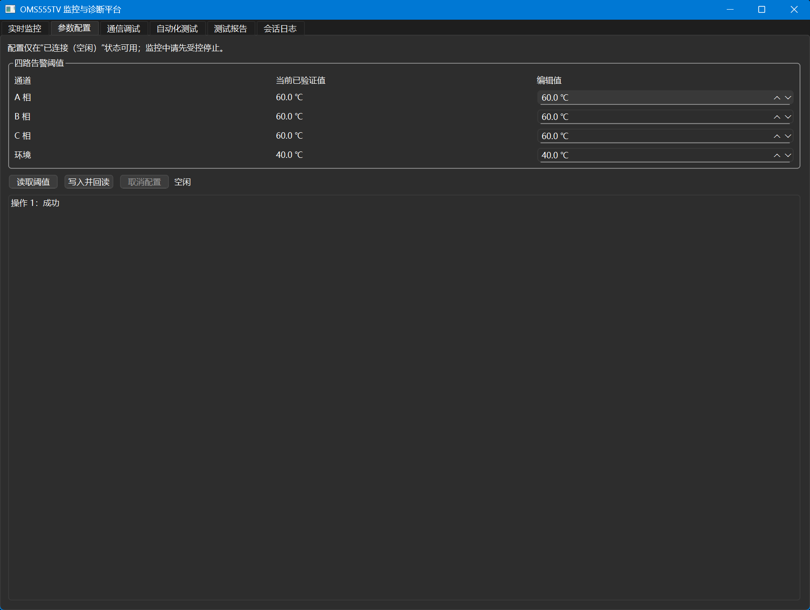
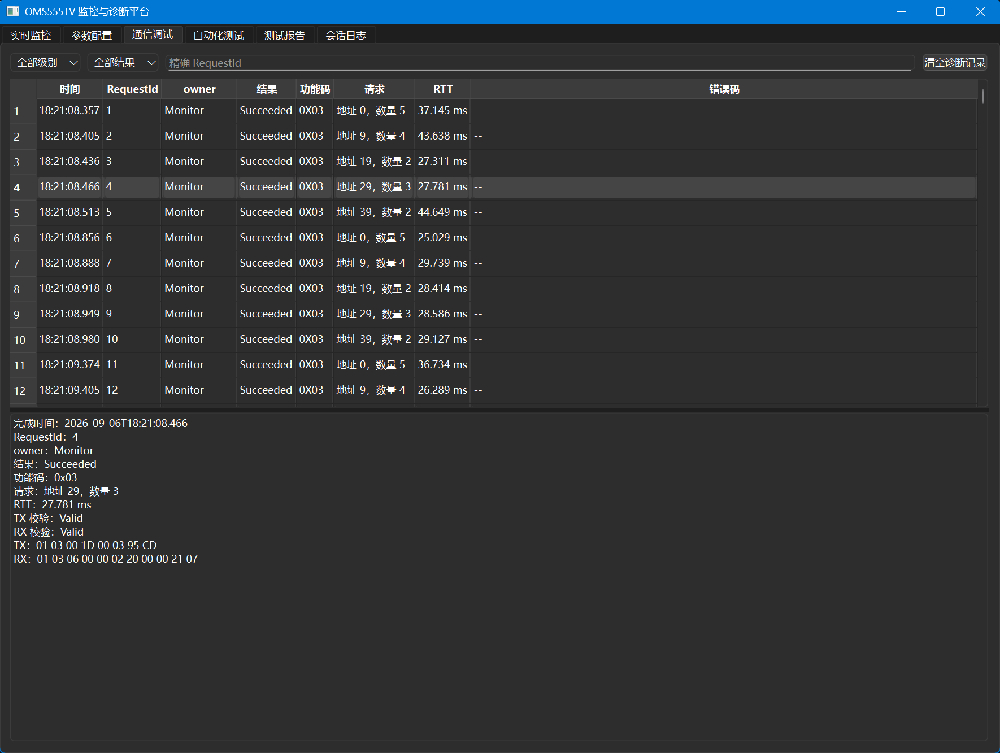

# Phase 9 展示素材清单

本目录保存 TASK-028 采集的真实硬件与生产 Host 截图。素材只用于说明当前 MVP 在约 20 cm、安全低压、非隔离实验台架上的实际状态，不代表工业级隔离、长线传输、EMC、量产可靠性或跨平台能力。

## 采集规范

- 硬件照片使用 JPEG，建议横向、至少 1600×900；UI 截图使用 PNG，保持生产窗口默认 1180×860 或更高分辨率。
- UI 必须来自 `build-host-task026/src/oms555tv_host.exe` 生产可执行文件。不得用测试替身、设计稿或编辑后的状态冒充实机结果。
- 允许的后处理仅限裁切无关桌面边缘、等比例缩放、适度无损/有损压缩，以及遮挡设备序列号或无关隐私；不得改变端口、数值、状态、统计、报文或 PASS/FAIL 含义。
- 不显示 Windows 用户目录、设备序列号、无关应用、个人通知或原始 SessionLog 路径。截图中出现的端口号仅表示该次运行时枚举结果，不是通用配置。
- 自动化结果只采集 Phase 5 短套件。该套件会短暂写入并独立回读阈值，随后恢复运行前读取的四路原值；若无法先读取基线或恢复失败，立即停止采集并保留失败事实。
- 不为素材重跑 Phase 6 的 10 分钟稳定性套件，也不执行 Phase 7 的人工断线流程。

## 固定文件与替代文本

| 文件 | 展示类别 | Markdown 替代文本 | 来源与真实性 | 状态 |
|---|---|---|---|---|
| [`hardware-rs485-bench.jpg`](hardware-rs485-bench.jpg) | 安全低压 RS485 台架 | NUCLEO-F411RE、TTL-RS485 模块、A/B 与公共地、USB-RS485 组成的短线安全低压台架 | 真实实机照片；约 20 cm、非隔离实验接线；纸签仅标识既有接线 | 已验收 |
| [`host-monitoring.png`](host-monitoring.png) | 设备监控 | 生产 Host 通过运行时枚举的 RS485 串口显示设备测量值、健康状态和通信统计 | 真实实机 UI；短时只读监控 | 已验收 |
| [`host-configuration.png`](host-configuration.png) | 参数配置 | 生产 Host 参数配置页显示从设备读取并验证的四路告警阈值 | 真实实机 UI；只读采集，不执行写入 | 已验收 |
| [`host-diagnostics.png`](host-diagnostics.png) | 通信诊断 | 生产 Host 通信调试页显示请求结果、功能码、RTT 与代表性 TX/RX 证据 | 真实实机 UI；来自本次短时读取 | 已验收 |
| [`host-automation-results.png`](host-automation-results.png) | 自动化测试结果 | 生产 Host 自动化测试页显示 Phase 5 短套件终态、8 条用例统计和代表性通信证据 | 真实实机 UI；含受控写入、回读与原值恢复 | 已验收 |
| [`host-report.png`](host-report.png) | 测试报告 | 生产 Host 生成的离线 HTML 报告显示基本信息、8/8 汇总和用例明细入口 | 真实结果脱敏；来自 Phase 5 RS485 短套件 | 已验收 |
| `../examples/task026-phase5-rs485-report.html` | 示例报告工件 | Phase 5 真实 RS485 短套件的离线自包含 HTML 报告 | 真实结果脱敏；只移除本机绝对路径，未修改测试结果 | 已复核 |

## 图片预览

## 完整性与来源

Host UI 使用 `build-host-task026/src/oms555tv_host.exe`，对应产品源码提交 `6a027c3`；采集时仓库文档基线为 `6a7aae0`。截图日期均为 2026-09-06，运行环境为 Windows x64、Qt 6.8.3 MSVC 2022、NUCLEO-F411RE、USART1/短线 RS485。画面中的 COM6 是本次运行时枚举结果，不是固定端口要求。

| 文件 | 像素尺寸 | 大小（字节） | SHA-256 |
|---|---:|---:|---|
| `hardware-rs485-bench.jpg` | 4096×3072 | 2,018,271 | `404D3BC2B03DF0BFF847A21034968989E9BDB5EB2A40F2D09BF187E169E5600A` |
| `host-monitoring.png` | 1770×1333 | 104,539 | `2B8972582CE3D0B494E3706A7846EA43E3F9E6C11372956EA800B53BBD971CA7` |
| `host-configuration.png` | 1770×1333 | 42,724 | `CA0FAB0E0C16B671B71DC91CDB5C38704D237167F6C93EDCDA2D8E544D5AB03F` |
| `host-diagnostics.png` | 1770×1333 | 98,274 | `73323204F45134D718A868EA2C81E956AC922BAC8FBAA7F5157BBDD1C04C0FA4` |
| `host-automation-results.png` | 2560×1528 | 161,574 | `8C8B9F1F08CC875C56C4E405EA2CB9AE729280C30892BF3CA75F278EF6D91B00` |
| `host-report.png` | 2549×1403 | 127,988 | `5D0BB46B3310DDB9AB1DEAC395A79593A29FAA472858F71F0DFFF9AD19BC721B` |

视觉验收确认图片未显示 Windows 用户目录、设备序列号、个人通知或无关日志路径。自动化页使用仓库相对套件路径；硬件图中的 A/B/GND 纸签只解释既有接线，没有改变接线或测试状态。硬件照片已移除原始 GPS、相机、拍摄时间等 EXIF 隐私元数据并重新核对画面，保留的色彩配置不含个人信息。完整采集、写入恢复和 Review 记录见 [TASK-028 验收记录](../test_results/task028_phase9_demo_assets.md)。

## 示例报告复核基线

- 文件：`docs/examples/task026-phase5-rs485-report.html`
- 来源：TASK-026 在真实 RS485 台架上执行 `testcases/functional/phase5-smoke.json` 后由生产 Host 生成。
- 结果边界：2026-09-06 单次短套件 8/8 PASS、11 个 RequestId/通信证据、Firmware 0.2；不能替代 Phase 6 主套件或长期稳定性结论。
- SHA-256：`CA02E7C326901648188A17EB32FC110EB779BAE086EAA66301F7D9844ADF394C`
- 离线性：无 HTTP/HTTPS URL，无 `src`/`href` 外部资源，无脚本。
- 脱敏性：未发现 Windows 绝对路径、本机用户名或设备序列号；保留的 `COM6` 仅属于该次真实运行记录。
- 一致性：报告显示 8/8 PASS、100.0000%、Firmware 0.2，其哈希与 TASK-026 验收记录一致。
